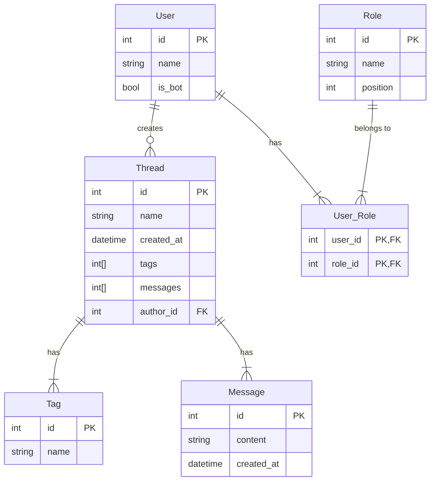

---
hide:
  - navigation
---
# Features

## Question forum
(to be added)

## Exam request
(to be added)

## ER Models

## Troubleshooting

**Bot isn't alerting new forum threads!**

1. Check that Vortex has sufficient permissions as described above.
2. Check which roles are being ignored with `>>ignored`. Take a look at the Ignoring Roles and Channels page for more information about ignored roles.
3. Check that you have the automod feature enabled with the `>>settings` command.

Make sure MusicCat is not muted for you by right clicking it in your voice channel. If it is not muted then try changing the voice region in Server Settings (you can change it right back).This will reset the voice connection to discord servers which may be wonky at times.

**Muting isn't working!**

1. Make sure that the Muted role exists and is configured properly for each channel. The easy way to configure it is to use the `>>setup` muterole command.
2. Make sure that there aren't any roles with a ✅ Send Messages override in your text channel settings; if a user has a role with a ✅ Send Messages override in a channel, they will be able to talk through the Muted role.

## Getting further support

### **Join the Support Server**
Feel free to join the support server and ask questions in the [`#support`](https://discord.gg/hikari) channel. Please make sure to include the following:

1. The exact issue you are having
2. Your server's ID
3. A screenshot of your server's `>>settings`

Please note that questions may be ignored if the information can already be found on this wiki.

### **Open an Issue**
If you believe you have found a bug, you can [**open an issue**](). Please do not use the issue page for questions or confusions.

[Join support server](https://discord.gg/hikari){ .md-button }