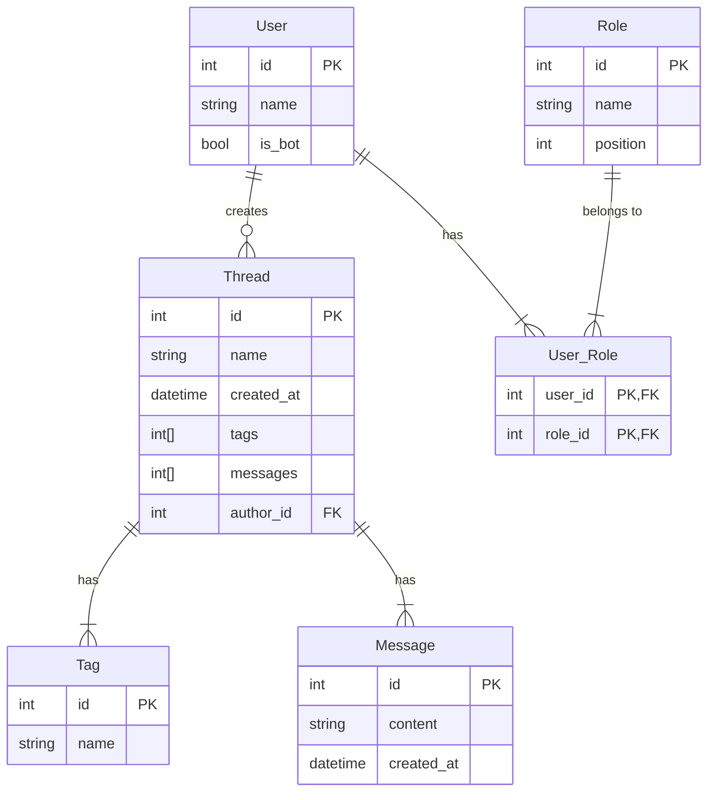

---
hide:
  - navigation
---
# Features

## Forum thread management

```mermaid
erDiagram
    Thread {
        int id PK
        string name
        datetime created_at
        int[] tags
        int[] messages
        int author_id FK
    }

    User {
        int id PK
        string name
        bool is_bot
    }

    User_Role {
        int user_id PK, FK
        int role_id PK, FK
    }

    Role {
        int id PK
        string name
        int position
    }

    User ||--|{ User_Role : has
    Role ||--|{ User_Role : "belongs to"

    User ||--o{ Thread : creates
    
    Tag {
        int id PK
        string name
    }

    Thread ||--|{ Tag : has

    Message {
        int id PK
        string content
        datetime created_at
    }

    Thread ||--|{ Message : has

```

## Exam request 