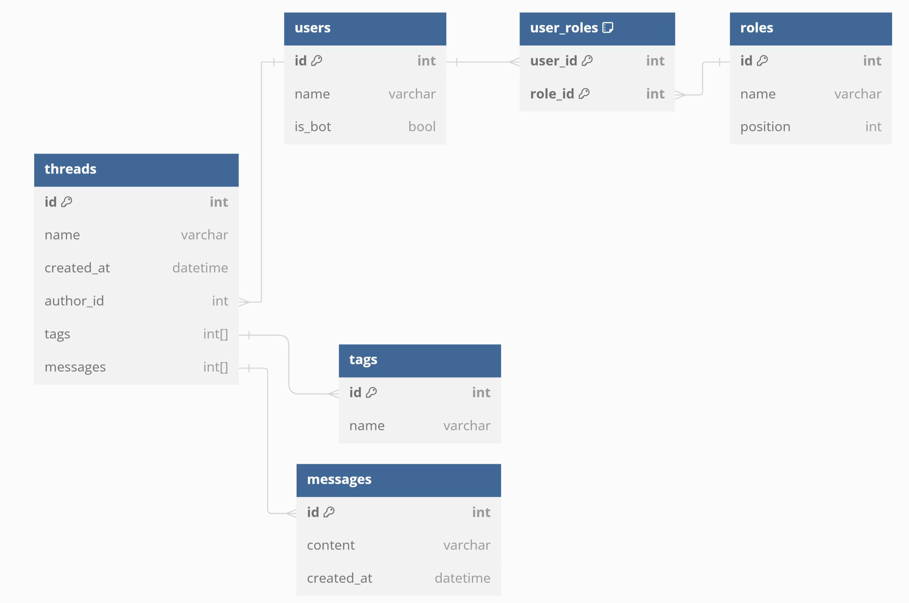

---
hide:
  - navigation
---
# Features

## Question forum

Teobot offers a streamlined solution for managing question forum posts within your server. Users can submit their questions through designated forum channels, categorize them based on topics or subjects, and moderators can review and assist in answering your questions.

With features like `tagging`, `searching`, and `sorting`, users can easily navigate through the forum to find relevant questions or contribute answers. The bot ensures an organized and efficient process for sharing knowledge and fostering discussions among community members.

## Exam request
Simplify the process of handling exam requests with the Discord bot's dedicated feature. Users can submit their exam requests specifying details such as the exam name, date, time, and any additional instructions. Moderators can then review and schedule exams accordingly, sending automated notifications to users with the relevant details. 

Additionally, the bot can manage exam registrations, track attendance, and provide reminders to ensure a smooth and well-organized examination process. By centralizing exam management within Discord, the bot enhances communication and coordination for both administrators and participants.

## ER Models



Using [`SQLAlchemy`](https://docs.sqlalchemy.org/en/20/orm/basic_relationships.html) as ORM to connect with PostgreSQL database allows for efficient management of database interactions. Example of the `Thread` model designed using SQLAlchemy:
```python
class Thread(Base):
    __tablename__ = "threads"

    id: Mapped[str] = mapped_column(primary_key=True)
    name: Mapped[str] = mapped_column(nullable=False)
    created_at: Mapped[datetime] = mapped_column(
        DateTime(timezone=True), server_default=func.now(), nullable=False)
    tags: Mapped[list[str]] = mapped_column(ARRAY(String), nullable=False)
    messages: Mapped[list[str]] = mapped_column(ARRAY(String), nullable=False)

    author_id: Mapped[str] = mapped_column(
        ForeignKey("users.id"), nullable=False)
    author: Mapped["User"] = relationship(back_populates="threads")
```

## Troubleshooting

**Bot isn't alerting new forum threads!**

1. Check that Vortex has sufficient permissions as described above.
2. Check which roles are being ignored with `>>ignored`. Take a look at the Ignoring Roles and Channels page for more information about ignored roles.
3. Check that you have the automod feature enabled with the `>>settings` command.

Make sure MusicCat is not muted for you by right clicking it in your voice channel. If it is not muted then try changing the voice region in Server Settings (you can change it right back).This will reset the voice connection to discord servers which may be wonky at times.

**Muting isn't working!**

1. Make sure that the Muted role exists and is configured properly for each channel. The easy way to configure it is to use the `>>setup` muterole command.
2. Make sure that there aren't any roles with a ✅ Send Messages override in your text channel settings; if a user has a role with a ✅ Send Messages override in a channel, they will be able to talk through the Muted role.

## Getting further support

### **Join the Support Server**
Feel free to join the support server and ask questions in the [`#support`](https://discord.gg/hikari) channel. Please make sure to include the following:

1. The exact issue you are having
2. Your server's ID
3. A screenshot of your server's `>>settings`

Please note that questions may be ignored if the information can already be found on this wiki.

### **Open an Issue**
If you believe you have found a bug, you can [**open an issue**](). Please do not use the issue page for questions or confusions.

[Join support server](https://discord.gg/hikari){ .md-button }