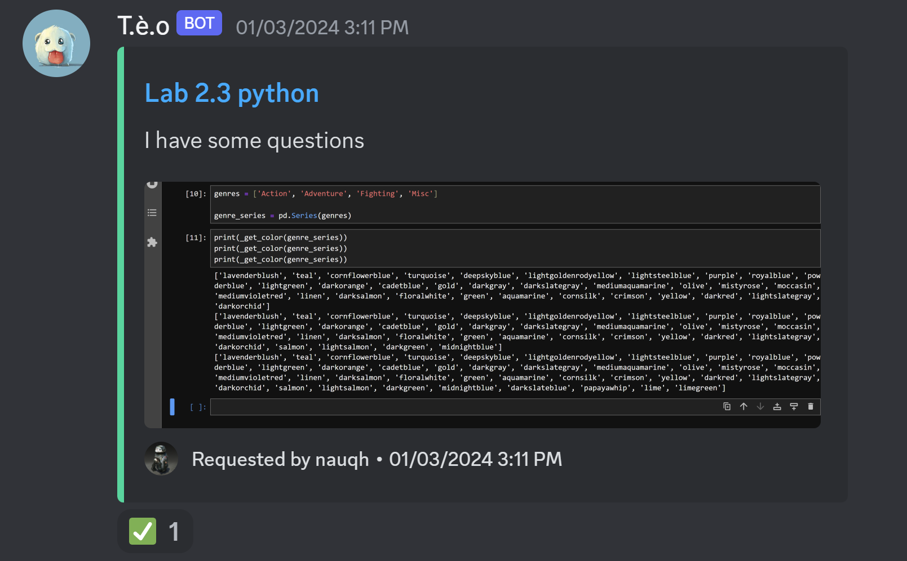

# 💡What's new

## Updates - 10 Feb 2024

To be released

## Updates - 3 Jan 2024

### **Forum post**
**Overview**: Forum thread posting notification and response

=== "Question forum"

    

    - [x] Alert moderator regarding recent forum query
    - [x] Add embed link to forum thread through discord embed
    - [x] Obtain and communicate resolution to address query posted

=== "Exam request"

    
   
    - [x] Notify and embed link to exam platform

### **Bug fixes**
- [x] Resolved issue where bot catches all `NewMessageCreate` events.
- [x] Resolved bug where bot send notification twice on new thread created.
